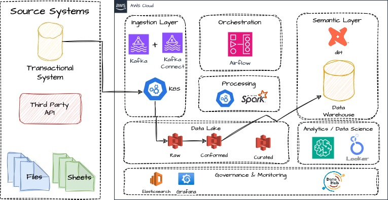
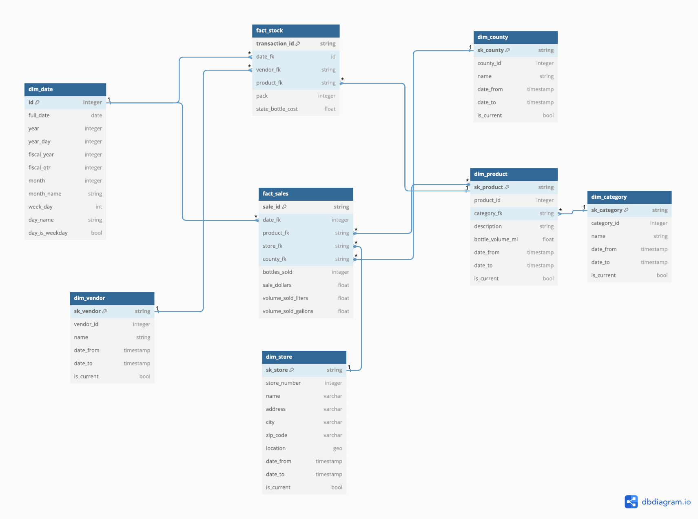

# yc-data

## Task #1

1.

```sql
with base as (
  SELECT
    state_bottle_retail,
    sale_dollars,
    ROUND(sale_dollars, 2) as revenue,
    bottles_sold,
    format_date('(%Y)-Q%Q', date(date)) as quarter
  FROM `bigquery-public-data.iowa_liquor_sales.sales`
),
totals as (
    select
    sum(bottles_sold) as total_products_sold,
    ROUND(sum(revenue),2) as total_revenue,
    quarter
  from base
  group by quarter
)
select
  *,
  case
    when total_revenue > (avg(total_revenue) over (partition by null)) * 1.1 then TRUE
    else FALSE
  end as ten_percent_above_avg
from totals
order by quarter
```

2.

```sql
select
  distinct county
from `bigquery-public-data.iowa_liquor_sales.sales`
where sale_dollars > 100000;
```

3.

```sql
with base as (
  SELECT
    store_name,
    max(sale_dollars) as max_revenue,
    min(sale_dollars) as min_revenue
  FROM `bigquery-public-data.iowa_liquor_sales.sales`
  group by store_name
),
top_10_biggest_revenue as (
  select
    store_name,
    ROUND(max_revenue, 2) as revenue,
    'biggest_revenue' as rank_type,
    rank() over (order by max_revenue desc) as position
  from base
  qualify position <= 10
),
top_10_lowest_revenue as (
  select
    store_name,
    ROUND(min_revenue, 2) as revenue,
    'lowest_revenue' as rank_type,
    rank() over (order by min_revenue asc) as position
  from base
  qualify position <= 10
),
final as (
  select
    * except(position)
  from top_10_biggest_revenue
  union all
  select
    * except(position)
  from top_10_lowest_revenue
)
select *
from final
order by rank_type, revenue desc
```

## Task #2

### Data Owner Questions

Before starting the development I would ask the following questions to the data owner:

1. How often is the data updated? Daily, weekly, monthly, hourly?
2. Is there any data catalog or data dictionary available? E.g. what does each column mean?
3. How is the data updated? Is it a full refresh or incremental?
   - In the case of incremental, how is the data updated? Already existing rows can be updated?
4. What is going to be the delivery format? CSV, JSON, etc?
   - Should we, the data engineering team, extract the data? If so, can we use CDC (Change Data Capture) tools? Or batch extraction?
   - In the case of batch extraction, what is the best time to extract the data to avoid impacting the production environment?

### Data pipeline development

Based on the data owner answers, some strategies would be different in order to better fit the data source aspects. However, the general idea of the data pipeline would remain the same.
In order to answer this question I will assume the following:

- The data is updated daily.
- The data is updated with a incremental refresh, meaning that only new rows are added to the data source.
- The data will be extracted in batch mode in a agreed time with the data owner.
- The data will be saved in JSON format (bigquery tables can have nested data so json would fit other tables from the same database that could have struct/array columns).

Main considerations:

- I am considering the data source is a relational database, instead of a Bigquery table.
- The data pipeline will be orchestrated by Apache Airflow.
- The extracted data will always be saved in a raw layer in the data lake - in order to enable us a reproducible data pipeline in case of need. It means we will assume a ELT approach.
  - The raw layer will be a S3 bucket.
  - It will be partitioned by source and date. This way we already have some metadata about the data: when it was extracted and from where.
  - Eg: s3://datalake/raw/iowa_liquor_sales/2024-01-01/
- The raw data will be parsed and saved in parquet format in a transformed layer in the data lake.
  - Some metadata columns will be added to the parquet files, such as: `transformed_at`, `transformed_by`, `source`, `extracted_at`, `extracted_by`.
  - Data Contracts will be applied in order to ensure data quality.
  - In the case data contracts are not met, the data pipeline will be stopped and the data engineering team will be notified.
  - The transformed layer will be a S3 bucket.
  - Eg: s3://datalake/transformed/iowa_liquor_sales/2024-01-01/
- The validated data will be loaded to a staging dataset in the Data Warehouse on an append only mode - table partitioned by date in order to allow an indepondent data pipeline for each day and improve performance.
- We will have dbt tool to apply transformations and data modeling in the data warehouse.

Below you can find the data architecture overview:



Based on the proposed data architecture overview, the data pipeline would be developed as follows for the mentioned case:

1. The data pipeline would be orchestrated by Apache Airflow.
2. The data pipeline would be scheduled to run daily.
3. The data pipeline would start by extracting the data from the source database in brach mode through a custom Python/Docker operator to run the necessary queries agasint the database.
4. The extracted data would be saved in a raw layer in the data lake (S3 bucket) in JSON format.
   - Raw layer is a very restricted data lake layer. It's only used to store the raw data in order to enable us a reproducible data pipeline in case of need.
   - Retention policy should be applied in order to improve the cost of the data lake.
     - We could use a lifecycle policy to move the data to a cheaper storage class after a certain period of time.
5. The raw data would be parsed and saved in parquet format in a conformed layer in the data lake.
   - This parse implies in applying data contracts in order to ensure data quality.
     - In case of issues with the data, the data pipeline would be stopped and the data engineering team would be notified along with the data owner.
     - The error handling can be done in different steps, considering error that can be retried and others that should be fixed before the data pipeline can be restarted.
     - SLA policies should be applied there as well.
6. The validated data would be loaded to a staging dataset in the Data Warehouse on an append only mode.
   - The table would be partitioned by date in order to allow an indepondent data pipeline for each day and improve performance.
7. dbt tool would be used to apply the transformations and model the data to a more analytics ready data model.
8. The data monitoring can be a combination of Airflow logs, Datahub, Monte Carlo, etc.
9. Last but not least, I would consider a data catalog tool like Datahub
   - It would be used to document the data and enable the data consumers to find the data they need.
   - Every data pipeline step should register the consumed and produced data in the data catalog.
   - It would also be used to document the data contracts and data quality rules.

#### Data Modeling

Once the data is already available in the data warehouse, we can start to apply the better data modeling techinique. In this case, since it's not very clear what questions we are trying to answer, I would go for a Kimball-like star schema, where we have a fact table with the main metrics and dimension tables with the context of the data.

The raw table is kind of a OBT (one big table) with a lot of information and the first thing is to identify what are the models we can create from it.

**Dimension tables:**

NOTE: it's important to properly define the SCD2 implementation in our pipeline to take care of possible late arrivals and updates in the source data.

- dim_store
  - scd2 table to keep track of the store changes
- dim_county
  - scd2 table to keep track of the county changes
- dim_product
  - scd2 table to keep track of the product changes
- dim_vendor
  - scd2 table to keep track of the vendor changes
- dim_date
  - auxiliar date table to help with date related queries

**Fact table:**

- fact_sales
  - This table will contain the main metrics of the sales, such as: revenue, quantity sold, etc.
  - Granularity: sale date
- fact_stock (from the raw table in this exercise, would not be possible to fully achieve this model without more information about transactions of product bought by the stores)
  - This table will contain the main metrics of the products bought by the stores, such as: quantity bought, cost, etc.
  - Granularity: purchase date



NOTE: data modeling diagram has been created with https://dbdiagram.io tool. You can use below code to replicate it in the website if needed.

```
// Use DBML to define your database structure
// Docs: https://dbml.dbdiagram.io/docs

Table dim_date {
  id integer [primary key]
  full_date date
  year integer
  year_day integer
  fiscal_year integer
  fiscal_qtr integer
  month integer
  month_name string
  week_day int
  day_name string
  day_is_weekday bool
}

Table dim_store {
  sk_store string [primary key]
  store_number integer
  name varchar
  address varchar
  city varchar
  zip_code varchar
  location geo
  date_from timestamp
  date_to timestamp
  is_current bool
}

Table dim_county {
  sk_county string [primary key]
  county_id integer
  name string
  date_from timestamp
  date_to timestamp
  is_current bool
}

Table dim_category {
  sk_category string [primary key]
  category_id integer
  name string
  date_from timestamp
  date_to timestamp
  is_current bool
}

Table dim_vendor {
  sk_vendor string [primary key]
  vendor_id integer
  name string
  date_from timestamp
  date_to timestamp
  is_current bool
}

Table dim_product {
  sk_product string [primary key]
  product_id integer
  category_fk string
  description string
  bottle_volume_ml float
  date_from timestamp
  date_to timestamp
  is_current bool
}

Table fact_sales {
  sale_id string [primary key]
  date_fk integer
  product_fk string
  store_fk string
  county_fk string
  bottles_sold integer
  sale_dollars float
  volume_sold_liters float
  volume_sold_gallons float
}

Table fact_stock {
  transaction_id string [primary key]
  date_fk id
  vendor_fk string
  product_fk string
  pack integer
  state_bottle_cost float
}


Ref: fact_stock.date_fk > dim_date.id
Ref: fact_sales.date_fk > dim_date.id

Ref: dim_product.category_fk > dim_category.sk_category

Ref: fact_sales.product_fk <> dim_product.sk_product
Ref: fact_sales.store_fk > dim_store.sk_store
Ref: fact_sales.county_fk > dim_county.sk_county

Ref: fact_stock.vendor_fk > dim_vendor.sk_vendor
Ref: fact_stock.product_fk > dim_product.sk_product
```

## Task #3

### Question 1

In order to solve this problem, I would first try to understand what is the main goal of Kafka in the data pipeline.

1. Is Kafka being used to store the data indefinitely and serve as a reproducible data source? If so, we should review the retention policy to avoid data loss.
   - If the issue was a data loss, we should try to recover the data from a existing backup or from the source - if possible.
2. Is Kafka being used to act as buffer between the data sources and the data warehouse/data lake? If so, we could set up a Kafka Connect cluster in order to extract the data from Kafka and save it in the data lake.
3. If we go with the second option, we should also review if transforming the data before loading to Kafka is the best option. I would recommend to load the raw data to Kafka and then transform it in the data lake/warehouse.

### Question 2

When we talk about Event pipeline, there are several patterns that can be used depending on the use case. The most used ones can be found in a great [Confluent Event Streaming docs](https://developer.confluent.io/patterns/)

Since our data source is a transaction system, I would go for a Event Source + Event Sink architecture, where the transaction system would be the Event Source and the Data Lake would be the Event Sink:

1. The transaction system can write directly to the database and we can use CDC tools like Debezium to capture the changes and write them to Kafka.
   - Combining this with Kafka Connect, we can use Kafka Connect Sinks (S3, GCS, etc) to write the data to the Data Lake
2. This way we can reproduce the data pipeline as needed and also consider real-time pipelines depending on the use case.
3. Data modeling should be applied on downstream systems like the Data Lake or Data Warehouse.
4. Failed events can be catch by Kafka in combination with Schema Registry and we can use a Dead Letter Queue to store them.
   - It's also possible to skip the schema registry and apply data contracts downstream in the data lake/warehouse.
   - In the case of failed events, we should save them on error bucket, notify the data engineering team in order to fix the issue and then replay the events.
5. Independently of the architecture, we should always consider the data contracts in order to ensure data quality, trying to push a Shift-left approach - working together with the data producers to have a better data quality.
